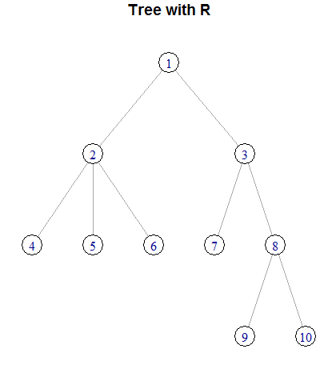

# 繪製Tree

## 結果：


```R
g <- make_empty_graph(directed=FALSE) #建立空圖，且無向
g <- add_vertices(g,10, color="white") #對g加入10個點，顏色為白色
g <- add_edges(g,c( #對g加入邊
  1,2,
  1,3,
  2,4,
  2,5,
  2,6,
  3,7,
  3,8,
  8,9,
  8,10
)) 
#把g畫出來，標題為Tree with R ，版型為樹，root為1
plot(g, main="Tree with R",layout=layout_as_tree(g,root=1))
```